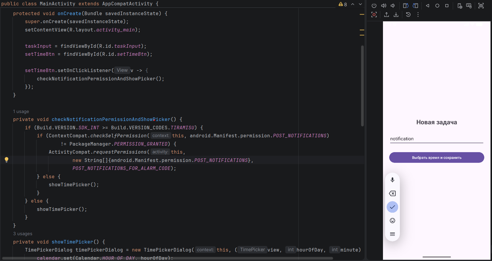
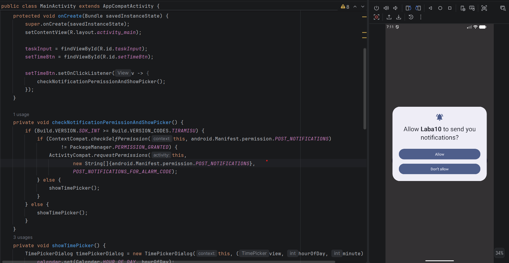

# Отчет

## Практическая работа №10

## Использование аппаратных возможностей устройства. Разрешения, уведомления, вибрация, камера

**Выполнил:**  
Самойлов Павел Олегович

**Курс:** 2

**Группа:** ИНС-б-о-24-1 

**Направление:** 09.03.02

**Профиль:** Информационные системы и технологии

**Проверил:**  Потапов Иван Романович

---

### Цель работы

Изучить механизм работы с разрешениями в Android, научиться создавать уведомления (Notification), управлять вибрацией устройства, а также получать доступ к камере для предварительного просмотра изображения.

### Ход работы
Задание. Планировщик заданий с уведомлением. Приложение позволяет создавать задачи с указанием времени. В указанное время отправляется уведомление (Notification) с напоминанием. Использовать AlarmManager или WorkManager для отложенных задач.

Приложение считывает текст из EditText и время, которое выбрано в TimePickerDialog. Создается Intent, когда придет время, запустится класс AlarmReceiver и передай ему текст задачи. Intent оборачивается в PendingIntent. Это дает системе Android право выполнить действие от имени приложения, даже если само приложение в этот момент будет полностью закрыто или выгружено из памяти. С помощью AlarmManager передается этот пакет операционной системе Android.

*Рисунок 1. Окно усновки напоминнай

*Рисунок 2. 

Реализация класса для срабатывания пробуждения.

	public class AlarmReceiver extends BroadcastReceiver {
    private static final String CHANNEL_ID = "TASK_CHANNEL";

    @Override
    public void onReceive(Context context, Intent intent) {
        String taskName = intent.getStringExtra("task_name");

        NotificationManager notificationManager = (NotificationManager) context.getSystemService(Context.NOTIFICATION_SERVICE);
        if (android.os.Build.VERSION.SDK_INT >= android.os.Build.VERSION_CODES.O) {
            NotificationChannel channel = new NotificationChannel(CHANNEL_ID, "Задачи", NotificationManager.IMPORTANCE_HIGH);
            notificationManager.createNotificationChannel(channel);
        }

        NotificationCompat.Builder builder = new NotificationCompat.Builder(context, CHANNEL_ID)
                .setSmallIcon(android.R.drawable.ic_lock_idle_alarm)
                .setContentTitle("Напоминание о задаче")
                .setContentText(taskName)
                .setPriority(NotificationCompat.PRIORITY_HIGH)
                .setAutoCancel(true);

        notificationManager.notify((int) System.currentTimeMillis(), builder.build());
    	}
	}

### Вывод
В результате выполнения практической работы я изучил механизм работы с разрешениями в Android, научился создавать уведомления (Notification), управлять вибрацией устройства, а также получать доступ к камере для предварительного просмотра изображения.

### Ответы на контрольные вопросы

1.В чём разница между нормальными и опасными разрешениями? Приведите примеры.

Нормальные разрешения (Normal permissions) — не представляют угрозы для приватности пользователя. Они предоставляются автоматически при установке (например, INTERNET, ACCESS_NETWORK_STATE).

Опасные разрешения (Dangerous permissions) — предоставляют доступ к конфиденциальным данным пользователя (контакты, камера, микрофон, местоположение). Такие разрешения необходимо запрашивать во время выполнения приложения.

2.Как запросить опасное разрешение во время выполнения приложения? Опишите последовательность действий.

Последовательность действий:

Проверка: Вызываем ContextCompat.checkSelfPermission(). Если разрешение уже есть — выполняем действие.

Запрос: Если разрешения нет, вызываем ActivityCompat.requestPermissions(), передав массив нужных разрешений и уникальный код запроса (Request Code).

Обработка: В Activity переопределяем метод onRequestPermissionsResult(), где проверяем, нажал ли пользователь «Разрешить» или «Отклонить».

3.Для чего нужен NotificationChannel в Android 8.0 и выше?

Начиная с Android 8.0 (API 26), все уведомления должны принадлежать какому-то каналу.

Управление пользователем: Пользователь может зайти в настройки телефона и отключить звук для одного канала, оставив его для другого, не отключая уведомления всего приложения сразу.

Группировка: Позволяет визуально и функционально разделять типы оповещений.

4.Как создать простое уведомление и отобразить его?

Создать канал (если Android 8.0+).

Создать билдер:

	NotificationCompat.Builder builder = new NotificationCompat.Builder(context, CHANNEL_ID)
    .setSmallIcon(R.drawable.icon)
    .setContentTitle("Заголовок")
    .setContentText("Текст уведомления")
    .setPriority(NotificationCompat.PRIORITY_DEFAULT);

Отобразить через NotificationManagerCompat.from(context).notify(ID, builder.build()).

5.Какие методы класса Vibrator используются для создания вибрации? Как создать вибрацию с заданным паттерном?

Для простых вибраций раньше использовался VibrationEffect.
Создание паттерна: Используется массив long[]

6.Как получить доступ к камере для предварительного просмотра? Какие классы для этого используются?

Для доступа к камере используется класс Camera (устаревший) или Camera2 (современный API). В данной работе рассмотрим упрощённый вариант с использованием SurfaceView для предварительного просмотра (preview) с камеры.

Необходимые шаги:
1. Добавить разрешение CAMERA в манифест.
2. Запросить разрешение во время выполнения (если Android 6+).
3. Создать SurfaceView для отображения превью.
4. Получить доступ к камере и передать SurfaceHolder в качестве цели для превью.

7.Что произойдёт, если попытаться использовать опасное разрешение без его запроса во время выполнения на Android 6.0+?

Приложение аварийно завершится

8.Как проверить, есть ли у приложения определённое разрешение в данный момент?

	int permissionCheck = ContextCompat.checkSelfPermission(context, Manifest.permission.CAMERA);

	if (permissionCheck == PackageManager.PERMISSION_GRANTED) {
    	// Разрешение есть
	} else {
    	// Разрешения нет (PERMISSION_DENIED)
	}
